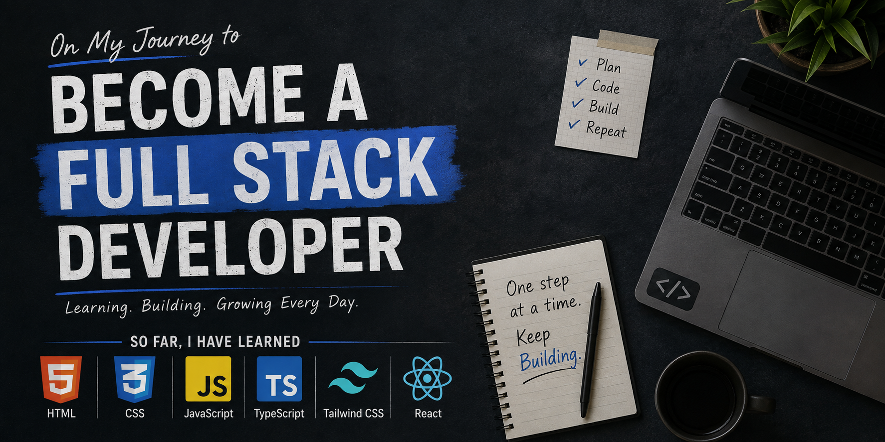

  

<h1 align="center">Hi 👋, I'm TANVIR AHMED MAHIN</h1>
<h3 align="center">A passionate Full Stack Developer in the making.</h3>

---

<h2 align="left">👨‍💻 About Me</h2>

I'm a passionate Full Stack Developer in the making who enjoys building
modern, responsive, and user-friendly web applications. I love learning
new technologies, solving problems, and turning ideas into real-world
projects. Currently, I'm focusing on improving my skills in React,
TypeScript, Next.js, and full-stack web development.

---

<h2 align="left">🚀 What I'm Currently Doing</h2>

<ul>
  <li>🔭 Exploring <strong>Next.js</strong> and modern React development</li>
  <li>📚 Improving my <strong>TypeScript</strong> and full-stack development skills</li>
  <li>🛠️ Building projects to strengthen my frontend and backend knowledge</li>
  <li>💡 Learning and experimenting with new web technologies</li>
</ul>

---

  📫 How to reach me:
  <strong>tanvirahmedmahinsarker@gmail.com</strong>

<h3 align="left">🌐 Connect with me:</h3>

  
  

  

  

  

---

<h2 align="left">💻 Languages and Tools</h2>

  

  

  

  

  

  

---

<h2 align="left">📊 GitHub Stats</h2>

  

